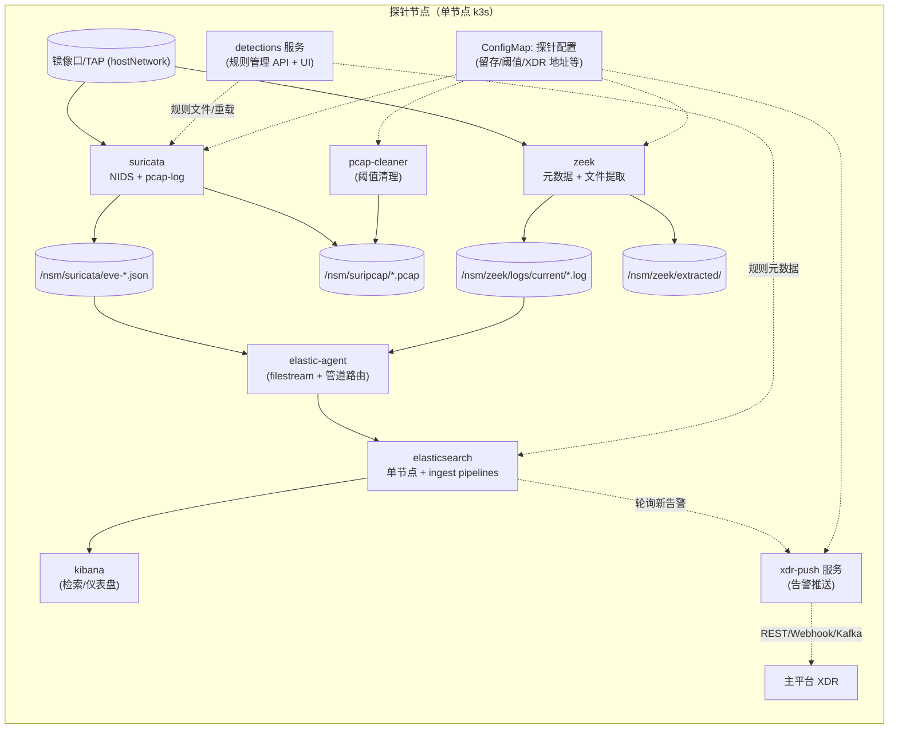

# NDR 探针架构设计（容器化 · 目标 k3s）

> 版本：v0.1（开发前设计稿，待评审）
> 关联文档：[调研报告-Security-Onion-3.1.0-suricata-zeek数据管道.md](调研报告-Security-Onion-3.1.0-suricata-zeek数据管道.md)
> 本设计大量复用 SO 3.1.0 已验证的配置资产（详见 §7）。

---

## 1. 定位与范围

- 本单元是 **NDR 流量探针**：负责镜像口流量采集、检测、元数据生成、全包留存、告警产生与归一化，并将告警推送到主平台 **XDR**。
- 部署形态：**每台探针 = 一个单节点 k3s**；k3s 等基础设施本身不纳入开发范围，本单元交付的是**容器镜像 + k8s 清单/Helm Chart + 配置文件**。
- 探针本地职责：Zeek 元数据可检索（ES）、全包文件（pcap-log）+ 告警留存、Detections 式规则管理。
- 探针不建 SIEM；检索用本地 ES + Kibana，告警推送由独立 XDR 推送服务完成。

## 2. 总体架构



## 3. 容器清单（一次交付）

| 容器 | 职责 | 运行方式 | 说明 |
|---|---|---|---|
| `so-suricata` | NIDS 检测 + eve.json + pcap-log 全包 | hostNetwork + privileged + DaemonSet | 基于 SO 镜像瘦身，AF_PACKET 抓包 |
| `so-zeek` | 协议元数据 + 文件提取 | hostNetwork + privileged + DaemonSet | 基于 SO 镜像瘦身，JSON 日志 |
| `elastic-agent` | 采集 eve/zeek/strelka 日志 → Logstash | DaemonSet（standalone） | 动态 `@metadata.pipeline` 路由（对齐 SO） |
| `fleet-server` | Fleet Server（agent 策略/令牌/输出下发） | Deployment（8220） | 对齐 SO Fleet 托管；fleet-init 自动供给 |
| `elasticsearch` | 本地元数据/告警存储 + ingest pipeline 归一化 | Deployment + LocalPV | 单节点，ILM 自动清理 |
| `kibana` | 检索/仪表盘 | Deployment | 可选但建议保留 |
| `detections` | 规则管理（CRUD/启停/阈值/自定义规则）+ 规则下发 | Deployment | 自研（Go/Python），含轻量 UI |
| `xdr-push` | 消费新告警 → 推送 XDR，重试/去重/断点 | Deployment | 自研（Go），见 §6.3 |
| `cleaner` | 按配置阈值清理全包/过期日志/提取文件 | CronJob | 留存天数 + 存储上限双阈值，见 §5.9 |

> 说明：单机探针规模小，**不引入 Fleet Server、Logstash、Redis 队列**（保留扩展位，见 §9）；告警推送由 `xdr-push` 轮询 ES 实现，简化链路。

## 4. 数据管道设计

### 4.1 端到端流程

1. **抓包**：suricata 与 zeek 各自 AF_PACKET 抓镜像口流量（复用 SO：suricata `cluster-id 59 / cluster_flow / threads N`；zeek `af_packet_fanout_id 23 / FANOUT_HASH / lb_procs N`）。
2. **落盘**：
   - suricata：eve.json 按小时轮转 `/nsm/eve-%Y-%m-%d-%H:%M.json`；pcap-log `%n/so-pcap.%t`（1000MB/个，多文件，可 LZ4）。
   - zeek：JSON 协议日志 `/nsm/zeek/logs/current/*.log`；文件提取 `/nsm/zeek/extracted/complete/`。
   - 详细落盘设计见 §4.3。
3. **采集**：elastic-agent（Fleet 托管）监听 `/nsm/suricata/eve*.json`、`/nsm/zeek/logs/current/*.log` 与 `/nsm/strelka/log/strelka.log`；集成由 Fleet 策略下发（filestream），Zeek 按文件名 JS 设 `@metadata.pipeline=zeek.<logname>`；Suricata 固定 `suricata.common`；ICS 日志自动打 `ics` tag。
4. **归一化**：ES ingest pipeline（复用 SO 的 `zeek.*` / `suricata.*` / `strelka.file` / `common`），字段映射 ECS：`id.orig_h→source.ip`、`community_id→network.community_id`、`sensorname→observer.name`、`event.dataset=module.dataset` 等。
5. **存储**：数据流（沿用 SO 命名）：
   - `logs-zeek-so`（Zeek 全部日志，`event.dataset=zeek.conn/...`）
   - `logs-suricata.alerts-so`（Suricata 告警，管道显式 `_index` 路由）
   - `logs-zeek.notice` 归入 `logs-zeek-so`（`event.dataset=zeek.notice`）
   - `logs-strelka-so`（文件分析，若启用）
   - `logs-detections.alerts-*`（Detections 派生告警，若启用）
   - `logs-soc-so`（探针自身服务日志）
6. **告警推送**：`xdr-push` 监听 `logs-suricata.alerts-so` + `logs-zeek-so(event.dataset=zeek.notice)` 的新增告警（高频轮询游标，默认 2s），**实时主动 POST 到配置文件中维护的 Webhook URL**（XDR 侧以该 URL 接收）。

### 4.2 事件模型（ECS 子集，与 SO 一致）

| 字段 | 来源 | 示例 |
|---|---|---|
| `@timestamp` | 事件时间 | 2026-08-09T12:00:00Z |
| `event.dataset` | zeek/suricata 类型 | zeek.conn / suricata.alert |
| `event.module` | zeek/suricata/strelka/soc | zeek |
| `event.category/type` | 网络事件分类 | network / alert |
| `event.severity + severity_label` | 告警级别（common 管道分级） | 1-4 → low/high/critical |
| `source.ip/port`、`destination.ip/port` | 五元组 | 10.0.0.1:1234 → 10.0.0.2:80 |
| `network.transport/protocol` | tcp/udp + 应用协议 | tcp / http |
| `network.community_id` | 跨引擎关联主键 | 1:JzzocikZDis8ICy2xnNRDG6ZAK4= |
| `network.bytes/packets` | 流量统计 | 592 / 6 |
| `observer.name` | 探针标识（sensorname） | nss-001 |
| `rule.name/signature/uuid` | Suricata 规则命中 | GPL ATTACK_RESPONSE... |
| `log.id.uid` | zeek uid / suricata flow_id | CgD7r4R0yIirXqF0c |
| `related.ip` | 关联 IP 列表 | [10.0.0.1,10.0.0.2] |
| `host.name` | 探针主机名 | nss-001 |

### 4.3 日志与全包落盘设计（/nsm 布局）

#### 4.3.1 目录布局（数据盘 PV 挂载 /nsm）

```text
/nsm/                                        # 数据盘（LocalPV），所有流量数据落这里
├── suricata/
│   └── eve-2026-08-09-12:00.json            # eve.json 系列：按小时轮转，文件名带时间戳
├── zeek/
│   ├── logs/
│   │   ├── current/                         # 活跃日志：conn.log / dns.log / http.log / ssl.log ...
│   │   └── <rotated>/                       # 轮转历史（1h 一次，gzip 压缩，仅留档不采集）
│   ├── spool/                               # zeekctl spool（state.db、暂存）
│   └── extracted/
│       ├── <staging>/                       # 提取中的临时文件
│       └── complete/<md5>.<ext>             # 提取完成（md5 命名天然去重）
├── suripcap/                                # Suricata 全包（pcap-log）
│   ├── so-pcap.2026-08-09-12:00:00.1.pcap
│   └── so-pcap.2026-08-09-12:30:00.2.pcap
├── strelka/                                 # （可选）文件分析输入/输出
├── elasticsearch/                           # ES 数据目录（可独立 LocalPV，见 §4.3.3）
└── import/                                  # （可选）离线 pcap 导入
```

#### 4.3.2 引擎落盘行为表

| 数据 | 路径 | 轮转 | 压缩 | 采集方式 | 清理策略 |
|---|---|---|---|---|---|
| Suricata eve.json | `/nsm/suricata/eve-%Y-%m-%d-%H:%M.json` | 每小时（`rotate-interval: hour`） | 不压缩（采集器边读边走） | elastic-agent 匹配 `eve*.json`（含已轮转文件，排除 `.gz`） | 采集完成后按 `suricata.eve.retention_days`（默认 7）删除 |
| Suricata 运行日志 | 容器内 `/var/log/suricata/` | 容器日志滚动 | - | 不采集 | 随容器日志轮转 |
| Suricata 全包 | `/nsm/suripcap/so-pcap.%t` | 单文件 `limit=1000MB`、`mode: multi` 自动续写 | 可选 LZ4 | 不采集（供 XDR 按需拉取/取证） | **三层保险**：① Suricata `max-files` 自限制（第一道）；② cleaner 双阈值（天数+容量）；③ 磁盘压力兜底（见 §5.9） |
| Zeek 协议日志 | `/nsm/zeek/logs/current/*.log` | 每小时（`LogRotationInterval=3600`） | `CompressLogs=1` gzip 后移入历史目录 | elastic-agent 只 tail `current/*.log` | 历史目录按 `zeek.history_retention_days`（默认 30）清理 + 磁盘压力兜底 |
| Zeek 提取文件 | `/nsm/zeek/extracted/complete/<md5>.<ext>` | - | - | 不采集（交 Strelka 或留档） | 按 `zeek.extraction.max_days`（默认 7）清理 + 磁盘压力兜底 |
| Zeek 运行日志 | `/nsm/zeek/logs/current/{reporter,stats,stderr,stdout}.log` | 随轮转 | gzip | **排除**（elastic-agent exclude_files） | 随历史目录清理 |
| ES 索引数据 | `/nsm/elasticsearch/` | ILM rollover | - | - | ILM：hot→cold→delete（`metadata_days` 默认 60 / `alerts_days` 默认 365） |

#### 4.3.3 磁盘规划建议

- **容器化部署不依赖分区方案，按"挂载目录"监控**：
  - 本项目以容器 + k8s 清单交付，`/nsm`、ES 数据目录等均为 **LocalPV/hostPath 挂载目录**；底层文件系统由部署方提供（独立分区 / LVM / RAID / NFS，或根分区下的普通目录），探针不感知、不干预。
  - 空间监控/清理只认两个运行时指标（见下），与"是否独立分区"无关，因此 **ISO 安装时的分区规划在本项目不存在，也不需要**。
- **两类监控指标（cleaner 与状态页使用）**：
  - **目录级用量（执行配额）**：`du` 统计 `/nsm/suripcap`、`/nsm/zeek/logs`、`/nsm/zeek/extracted` 等目录实际占用 → 用于执行 `storage_limit_gb` 与按天清理。目录级统计对"根分区下子目录"同样有效。
  - **文件系统级容量（压力兜底）**：`df` 查看挂载点所在文件系统用量 → 用于 `disk_pressure_threshold`（90%）与 `min_free_gb` 兜底。注意：若 `/nsm` 只是根分区子目录，`df` 反映的是整个根分区（含系统/容器镜像），阈值需按整体评估。
- **挂载点规划（推荐，非强制）**：
  - `/nsm` 建议独立挂载（数据盘）：流量数据（eve/zeek/suripcap/extracted）IO 型负载，建议 SSD/高速盘。
  - `/nsm/elasticsearch` 建议独立挂载（索引盘），避免与流量 IO 争抢；容量按 `metadata_days + alerts_days` 估算。
  - 若部署方只给一块盘，则全部挂根分区子目录，探针逻辑不变，仅兜底阈值按整盘评估。
- **k3s 侧注意**：
  - LocalPV/hostPath 上声明的 `capacity` 仅用于展示，**不强制配额**；kubelet 的 nodefs 驱逐只清理容器/镜像层，**不会清理 `/nsm` 数据** → cleaner 是数据清理的唯一执行者，必须保证其运行。
  - cleaner/状态采集以 DaemonSet/CronJob + hostPath 挂载运行，容器内 `df`/`du` 直接看到宿主文件系统。
- **容量估算**（写入配置模板注释）：
  - 全包：受 `storage_limit_gb` 封顶，或在 `retention_days × 每日产生量` 中取先到者。
  - 元数据：经验值约 1-3 KB/事件 × 事件率（PPS）× 3600 × 24 × `metadata_days`；ES 膨胀系数约 1.1-1.3。
- **启动自检**：探针启动时检查 `suripcap` 剩余容量，低于 `probe.min_free_gb`（默认 20GB）时告警并触发一次清理。
- **磁盘压力兜底（借鉴 SO `zeek_clean`）**：无论留存阈值如何配置，cleaner 每次运行时若 `/nsm` 用量 > `probe.disk_pressure_threshold`（默认 90%），强制循环删除最旧文件（zeek 历史目录 → 提取文件 → 全包），直到用量回落到阈值以下；防止配置不当/异常流量导致盘满。

#### 4.3.4 配置项映射（对应 §6.1 探针配置文件）

| 配置项 | 默认值 | 作用对象 |
|---|---|---|
| `suricata.pcap.retention_days` | 7 | suripcap 按天清理 |
| `suricata.pcap.storage_limit_gb` | 500 | suripcap 总量上限 |
| `suricata.pcap.file_size_mb` | 1000 | pcap-log 单文件大小 |
| `suricata.pcap.compression` | none/lz4 | pcap-log 压缩 |
| `suricata.eve.retention_days` | 7 | eve.json 留档天数 |
| `zeek.log_rotation_interval_s` | 3600 | zeek 日志轮转周期 |
| `zeek.history_retention_days` | 30 | zeek 轮转历史留档天数 |
| `zeek.extraction.max_days` | 7 | 提取文件留档天数 |
| `elasticsearch.retention.metadata_days` | 60 | ES ILM（元数据） |
| `elasticsearch.retention.alerts_days` | 365 | ES ILM（告警） |
| `probe.min_free_gb` | 20 | 磁盘低水位告警/触发清理 |
| `probe.disk_pressure_threshold` | 90 | `/nsm` 用量百分比，超过触发强制清理（兜底） |
| `probe.cleanup_interval` | 1h | cleaner 扫描周期 |

## 5. 组件详细设计

### 5.1 suricata（NIDS + 全包）

- 镜像：基于 `so-suricata:3.1.0` 瘦身（去掉无关依赖），Suricata 8.0.5。
- 配置：`suricata.yaml` 由探针配置渲染（ConfigMap → /etc/suricata），关键项：
  - `af-packet`：interface=镜像口、cluster-id 59、cluster_flow、threads 按核数配。
  - `eve-log`：`community-id: true`、小时轮转、alert 记录 `payload_printable + packet`。
  - `pcap-log`：enabled（配置开关）、`limit` 单文件大小、`max-files`（由存储配额自动计算，Suricata 侧第一道自限制，参考 SO）、LZ4 压缩选项。
  - `HOME_NET/EXTERNAL_NET`、BPF（可选）、应用层协议开关。
- 规则：`/etc/suricata/rules/` 挂载规则目录（detections 服务写入），`suricatasc reload` 热加载。
- 默认规则：**空规则集**（用户要求，默认不带任何规则）。
- 工具：`so-suricata-testrule`（单条规则 + pcap 验证）。

### 5.2 zeek（元数据引擎）

- 镜像：基于 `so-zeek:3.1.0` 瘦身，Zeek 8.0.8。
- 复用 SO 资产：`json-logs`、`community-id-extended`、`conn-add-sensorname`、`bpfconf`、`file-extraction`（MIME 白名单）、`cve-2020-0601`、intel（可空）、`local.zeek` 加载清单（ja3/ja4/hassh/ICS 插件可按需裁剪）。
- 运行：`node.cfg` 多 worker（fanout 23）、`zeekctl.cfg` 轮转 1h + 压缩。
- 文件提取：白名单可配，`FileExtract::default_limit` 9MB，输出 `/nsm/zeek/extracted/complete/<md5>.<ext>`。

### 5.3 elastic-agent（standalone）

- 与 ES 同版本（8.x/9.x 待定，见 §10）。配置两个 filestream input（eve、zeek），processor：dissect 文件名 → JS 设 `@metadata.pipeline` → add_fields（module/category）→ ICS tag。
- 输出：直连本地 ES（https + 认证），`pipeline` 由 `@metadata.pipeline` 指定（同 SO 的 Logstash 输出语义）。

### 5.4 elasticsearch

- 单节点、单副本 0、ILM：hot rollover → cold 60d（可配）→ delete（可配）。
- 启动时导入 ingest pipelines（从镜像内 assets 目录或 initContainer 加载 SO 的 pipeline JSON）与组件模板（ECS、DTC、so-* mappings）。
- 认证：本地自签 CA + 内置用户（filebeat/detections/xdr-push 各一）。
- 资源：heap 默认 1-2GB（可配）；数据目录 LocalPV。

### 5.5 kibana（可选）

- 与 ES 同版本；提供元数据检索与告警查询；默认只读用户。

### 5.6 detections（规则管理服务，自研）

- 存储：规则文件（`/opt/so/rules/suricata/`）+ 规则元数据索引（`logs-detections.*`，复用 SO detections 数据流设计）。
- API：
  - 规则 CRUD（内置规则集/自定义规则分开管理）
  - 启用/禁用、阈值/抑制（threshold/suppress）
  - 规则集分组（如 ET 类、自研类、SO_FILTERS/SO_EXTRACTIONS 类）
  - 规则下发 → 写规则文件 → `so-suricata-reload-rules`（suricatasc）
  - 规则命中统计（从 ES 聚合告警索引）
- UI：先交付 REST API + 轻量管理页（后续迭代完整 SOC 式界面）。

### 5.7 xdr-push（告警推送服务，自研 Go）

- 输入：高频轮询 ES（`search_after`，默认 `push_interval_s=2`，可配）`logs-suricata.alerts-so` + `zeek.notice` 新文档；用文档 `_id` 做游标与去重（`metadata._id` 幂等）。
- 转换：ES 文档 → Webhook 告警报文（见 §5.8 报文规范），字段裁剪 + 枚举映射 + 探针标识。
- 输出：**Webhook**——配置文件中维护 `xdr.webhook.url` 变量；每产生一条新告警即主动 POST（实时推送），不依赖 XDR 轮询。
- 可靠性：
  - 本地持久化游标（PV），探针重启断点续传，不重复推送已确认文档。
  - 失败重试（指数退避 + 上限），超时重试，超限进入死信（本地 `logs-xdr-push-dlq` 或文件）。
  - 报文含 `alert_id`（ES 文档 `_id`）作为幂等键，XDR 可据此去重。
  - 可选 HMAC-SHA256 签名头（`xdr.webhook.secret` 配置，未配置则不签名）。
- 配置：Webhook URL/Secret/超时/重试/推送间隔/推送白名单（默认 `suricata.alert`、`zeek.notice`）。

### 5.8 Webhook 告警报文规范（v1 草案，供 XDR 侧对接）

```json
{
  "schema_version": "1.0",
  "probe_id": "nss-001",
  "alert_id": "es-document-_id",
  "timestamp": "2026-08-09T12:00:00.000Z",
  "source_type": "suricata.alert",
  "event": {
    "kind": "alert",
    "category": ["network"],
    "type": ["intrusion_detection"],
    "severity": 1,
    "severity_label": "low",
    "module": "suricata",
    "dataset": "suricata.alert"
  },
  "rule": {
    "name": "ET MALWARE ...",
    "signature": "alert tcp $HOME_NET any -> $EXTERNAL_NET any ...",
    "uuid": "2024211",
    "category": "attempted-user-admin",
    "reference": "url,https://...",
    "rev": 5
  },
  "source": { "ip": "10.0.0.1", "port": 52341, "mac": "00:0c:29:..." },
  "destination": { "ip": "8.8.8.8", "port": 443, "mac": "..." },
  "network": {
    "transport": "tcp",
    "protocol": "tls",
    "community_id": "1:JzzocikZDis8ICy2xnNRDG6ZAK4=",
    "bytes": 1234,
    "packets": 12
  },
  "observer": { "name": "nss-001", "hostname": "nss-001", "interface": "bond0" },
  "pcap": { "file": "so-pcap.2026-08-09-12:00:00.1.pcap", "offset_hint": "" },
  "raw": { "payload_printable": "", "base64": "" }
}
```

- 投递语义：`POST {url}`，`Content-Type: application/json`；2xx 视为成功；其余状态码/超时进入重试。
- 安全：可选 `X-NDR-Signature: sha256=hex(hmac_sha256(secret, body))`，XDR 可校验来源。
- `pcap.file`：全包已落盘时的文件引用，XDR 可按需通过探针 API 拉取（后续能力）。

### 5.9 cleaner（数据清理任务，CronJob）

- 职责：统一清理**磁盘原始文件**（防止流量盘写满），与 ES 侧 ILM（清理索引，防止索引盘写满）配套，两层互不替代。
- 运行形态：DaemonSet/CronJob，以 hostPath 挂载 `/nsm` 运行；容器内直接 `df`（文件系统级容量）与 `du`（目录级用量），不依赖部署方分区方案（见 §4.3.3）。
- 磁盘状态上报：每次运行将各挂载点/目录用量（`df -P`、`du -sb`）、剩余空间、触发动作写入 `logs-soc-so` 与状态页，供运维与 XDR 侧探针状态查询。
- 清理对象与规则（全部来自探针配置文件）：
  - `/nsm/suripcap/`：按 `suricata.pcap.retention_days`（天数）与 `suricata.pcap.storage_limit_gb`（目录总量上限）**双阈值**，先按天、再按总量删除最旧文件（取先到者）。
  - `/nsm/suricata/eve-*.json`：按 `suricata.eve.retention_days`（默认 7 天）删除已轮转且已被 elastic-agent 采集的旧文件。
  - `/nsm/zeek/logs/<rotated>/`：按 `zeek.history_retention_days`（默认 30 天）删除轮转历史（gz）。
  - `/nsm/zeek/extracted/`：按 `zeek.extraction.max_days`（默认 7 天）删除提取文件。
- 逻辑：CronJob 按 `probe.cleanup_interval`（默认 1h）扫描，分两级：
  1. **常规清理**：按留存天数/容量阈值删除过期文件（eve 旧文件、zeek 历史目录、提取文件、超阈值全包）。
  2. **磁盘压力兜底**：若 `/nsm` 用量 > `probe.disk_pressure_threshold`（默认 90%），循环删除最旧文件（顺序：zeek 历史 → 提取 → 全包），直到用量回落（借鉴 SO `zeek_clean` 机制）。
- 低水位保护：每次清理后校验 `/nsm` 剩余空间，仍低于 `probe.min_free_gb`（默认 20GB）时向本地日志/状态页告警。

## 6. 配置管理

### 6.1 探针统一配置文件（YAML，ConfigMap 挂载）

```yaml
probe:
  id: nss-001                 # 探针唯一标识（observer.name / 推送标记）
  interface: ""               # 镜像口：部署时按服务器实际网卡填写（如 enp5s0），不固化默认值
  home_net:                   # HOME_NET 地址组
    - 10.0.0.0/8
    - 192.168.0.0/16
  bpf: ""                     # 可选 BPF
suricata:
  enabled: true
  af_packet_threads: 4
  pcap:
    enabled: true
    file_size_mb: 1000
    compression: lz4
    retention_days: 7
    storage_limit_gb: 500
zeek:
  enabled: true
  workers: 4
  file_extraction:
    enabled: true
    mime_whitelist: [application/pdf, application/x-dosexec, ...]
elasticsearch:
  heap_gb: 2
  retention:
    metadata_days: 60
    alerts_days: 365
detections:
  default_ruleset: none        # 默认不加载任何规则
xdr:
  webhook:
    url: https://xdr.example.com/api/v1/alerts/webhook   # XDR 接收地址（配置文件维护，可改）
    secret: ""                                            # 可选 HMAC 签名密钥
  timeout_s: 10
  push_interval_s: 2
  retry_max: 5
  event_types: [suricata.alert, zeek.notice]
```

- 变更策略：ConfigMap 更新 → 相关容器 watch 或重启（k3s 天然支持）；后续可演进为 CRD。
- 敏感项（token/密码）用 k8s Secret。

## 7. 复用 SO 3.1.0 资产清单（核心策略：不造轮子）

| SO 资产 | 复用方式 | 用途 |
|---|---|---|
| `salt/elasticsearch/files/ingest/*.json`（2080 个） | 打包进 ES 镜像 init 导入 | 归一化管道 |
| `salt/elasticsearch/templates/component/*` | 导入 ES | ECS/DTC/so-* 映射模板 |
| `salt/zeek/policy/securityonion/*` | 打进 zeek 镜像 | JSON/CommunityID/sensorname/BPF/文件提取 |
| `salt/zeek/defaults.yaml` local.zeek 清单 | 渲染 local.zeek | 插件加载清单（按需裁剪） |
| `salt/zeek/files/{node,zeekctl,networks}.cfg.jinja` | 渲染模板 | Zeek 运行配置 |
| `salt/suricata/defaults.yaml` | 渲染 suricata.yaml | eve/pcap/af-packet 配置 |
| `salt/suricata/files/so_filters.rules`、`so_extraction.rules` | 内置规则集（默认禁用） | 日志裁剪/文件提取 |
| `salt/suricata/tools/*`（reload/restart/testrule） | 打进镜像 | 规则运维 |
| `so-import-pcap` 思路 | 后续可选 | 离线 pcap 分析 |

## 8. 开发里程碑

### M0：镜像与容器化跑通（1-2 周）
- 交付：suricata / zeek 瘦身镜像、k3s manifest（DaemonSet + PV + ConfigMap）、启动脚本。
- 验收：两引擎从镜像口抓包，eve.json 与 zeek JSON 日志正常落盘，无默认规则也能跑（0 告警）。

### M1：本地检索闭环（1-2 周）
- 交付：filebeat、elasticsearch、kibana；ingest pipeline 导入；数据流与 ILM。
- 验收：Zeek 元数据可检索（conn/dns/http/ssl），ECS 字段正确，`event.dataset=zeek.conn`，Kibana 可见。

### M2：告警与规则管理闭环（2-3 周）
- 交付：detections 服务（API + 轻量 UI）、xdr-push 服务、suricata 规则热加载。
- 验收：自定义规则命中 → `logs-suricata.alerts-so` → xdr-push **实时 POST Webhook URL**（XDR 沙箱接收）→ 本地告警可检索；规则启停/阈值生效；重试、断点续传、幂等去重正常。

### M3：全包与运维完善（2 周）
- 交付：pcap-log 全包 + pcap-cleaner 阈值清理、文件提取 + Strelka（可选）、健康检查/日志聚合、Helm Chart 化。
- 验收：pcap 留存天数/存储上限可配置并自动清理；探针重启自愈；告警不丢失。

## 9. 扩展位（本期不做，设计预留）

- Redis/Kafka 队列：多探针/高吞吐时在采集器与 ES 之间插入（复用 SO 管道）。
- Fleet/Elastic Agent：需要中心化管理时启用。
- 多探针管理面：规则统一下发、探针状态汇总（本期 detections 为单探针形态）。
- Strelka 文件分析：文件提取后做 YARA/ClamAV（本期只提取不分析）。
- 离线 pcap 导入（so-import-pcap 思路）。

## 10. 待确认项（需要 XDR 侧/产品侧输入）

1. **Webhook 报文规范确认**：§5.8 草案（字段/幂等键/HMAC）是否与 XDR 侧约定一致，XDR 侧若有既有格式要求请提供。
2. **ES 版本与许可**：沿用 Elasticsearch 9.3.3（与 SO 资产 100% 兼容，但为 Elastic License 2.0）；如需 Apache 2.0 可换 OpenSearch（ingest pipeline 大体兼容，需小改）。建议默认 ES 9.3.3。
3. **Kibana 是否保留**：检索优先用 Kibana 还是后续自研 UI（detections 页是否合并检索）？
4. **detections UI 范围**：先 REST API + 极简页，还是直接要 SOC 式完整界面？
5. **规则集初始来源**：默认空（已定）；内置 SO_FILTERS/SO_EXTRACTIONS 是否默认启用还是作为可选规则包。

## 11. 技术风险与对策

| 风险 | 影响 | 对策 |
|---|---|---|
| k8s 下 AF_PACKET 抓包权限/性能 | 抓包失败或丢包 | hostNetwork + privileged；容器内 setcap；按 SO 参数调优 ring-size/threads |
| 引擎与 ES 同机资源竞争 | 丢包/检索慢 | 资源 limits 预留；Zeek/Suricata worker 数按核数配置；ES heap 限制 |
| pcap 磁盘打爆 | 系统故障 | pcap-cleaner 双阈值（天数+容量）+ 启动自检 |
| 告警推送丢失/重复 | XDR 数据质量问题 | 游标持久化 + `document_id` 幂等 + 重试退避 + 死信 |
| Elastic License 合规 | 商业化受限 | §10.2 决策（OpenSearch 备选） |
| 引擎镜像体积大 | 部署慢 | 基于 SO 镜像瘦身（多阶段、裁剪依赖） |
