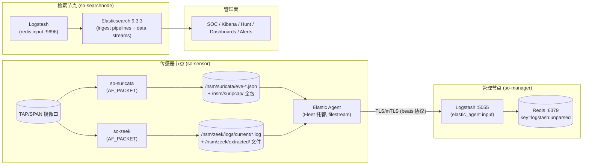

# Security Onion 3.1.0 Suricata + Zeek 流量分析数据管道调研

> 调研对象：Security Onion 3.1.0（tag `3.1.0-20260521`，热修复 `3.1.0-20260528`）
> 调研方式：官方文档（docs.securityonion.net/en/3/main）+ 官方发布说明 + 源码级分析
> （GitHub `Security-Onion-Solutions/securityonion` 3.1.0 分支、`securityonion-image` 容器镜像）
> 用途：为本项目 NDR 探针（同样采用 Suricata + Zeek 架构）提供设计与定制参考

---

## 1. 调研结论摘要

- SO 3.1.0 的核心组件版本：**Suricata 8.0.5、Zeek 8.0.8、Elastic Stack 9.3.3**，基于 Oracle Linux 9，全部组件以 Docker 容器运行，用 **SaltStack** 做配置下发与状态管理。
- 数据管道是一条 **"抓包引擎 → 日志落盘 → 轻量采集器 → 消息队列 → 解析索引 → 归一化 → 分析界面"** 的流水线，两端高度定制：
  - **采集侧定制**：Zeek/Suricata 的协议覆盖、日志格式、BPF、文件提取、传感器标识、Community ID 等均由 SO 的 Salt 状态 + 自研 Zeek 策略脚本定制。
  - **管道侧定制**：Elastic Agent（Fleet 托管）→ Logstash（5055）→ Redis 队列 → 第二段 Logstash → Elasticsearch，事件按 `@metadata.pipeline` 动态路由到对应的 **ingest pipeline**，把 Zeek/Suricata 原生字段映射为 **ECS 统一字段**。
- **存储侧定制**：按数据流（data stream）组织索引（Zeek 统一进 `logs-zeek-so`，Suricata 告警进 `logs-suricata.alerts-so`），叠加 ILM 生命周期、自定义组件模板（DTC 检测模板、IP 映射等）。
- 3.0 起最重要的架构变化：**Stenographer 被移除，全量包捕获改由 Suricata `pcap-log` 输出承担**（`/nsm/suripcap/`）；元数据引擎（`mdengine`）默认 Zeek，可全局切换为 Suricata。
- SO 的“定制开发”本质是：**不 fork 上游引擎代码**，而是通过 Salt 模板渲染配置 + 自研策略脚本（Zeek）+ 自研 ingest pipeline（ES）+ 自研 SOC 前端，把开源组件"胶水"成一个产品。

---

## 2. 总体架构与部署形态

### 2.1 节点角色（Salt 状态按角色裁剪）

| 角色 | 运行的关键组件 | 说明 |
|---|---|---|
| `so-standalone` | Manager + Sensor + Elastic Stack（Logstash/Redis/ES/Kibana） | 单机全栈，经 Logstash→Redis 队列 |
| `so-eval` | Manager + Sensor + Elastic Stack（**无 Logstash**） | 评估模式，Agent 直连 ES |
| `so-manager` | SOC、Kibana、Logstash、Redis、ES(管理)、Fleet、规则仓库 | 管理面，运行 Redis 队列 |
| `so-searchnode` | Elasticsearch、Logstash、Nginx | 从 Manager 的 Redis 拉数据、解析索引 |
| `so-sensor` | **Suricata、Zeek、Strelka**、tcpreplay、healthcheck | 纯传感器，只产日志不存日志 |
| `so-heavynode` | Sensor + 本地 ES/Logstash/Redis | 独立 Elastic 集群，跨集群搜索 |
| `so-import` | Manager + Sensor(去 Strelka/healthcheck) + ES/Kibana | 只做 pcap/evtx 离线导入分析 |
| `so-receiver` | Logstash + Redis | 管道冗余/扩容，active-active |

关键点：**传感器节点不写 Elasticsearch**，只产出日志文件，由本机 Elastic Agent 收走；存储/检索集中在 Manager/Search 节点。这对 NDR 探针"轻传感器 + 中心平台"的形态很有参考价值。

### 2.2 传感器节点的核心容器

- `so-suricata`（privileged + host 网络，AF_PACKET 抓包、NIDS、pcap-log、可选 metadata）
- `so-zeek`（privileged + host 网络，AF_PACKET 抓包、协议元数据、文件提取）
- `so-strelka-backend` / `so-strelka-frontend`（文件静态分析，YARA/ClamAV 等）
- 宿主机上的 **Elastic Agent**（Fleet 托管）负责采集 `/nsm/` 下的日志

---

## 3. Suricata + Zeek 数据管道全景（端到端）

### 3.1 逐段说明

1. **抓包**：Suricata 与 Zeek 各自以 AF_PACKET 直接从镜像口抓包（`cluster_flow`/`cluster-id 59`；Zeek 多 worker 用 `af_packet_fanout`），互不依赖、各吃一份流量。BPF 由 SOC 配置统一下发（`/opt/so/conf/suricata/bpf`、`/opt/so/conf/zeek/bpf`）。
2. **落盘**：
   - Suricata 输出 `eve.json`（按小时轮转：`/nsm/eve-%Y-%m-%d-%H:%M.json`）与 `pcap-log`（`/nsm/suripcap/`），告警、metadata、stats 同源。
   - Zeek 输出 **JSON 格式协议日志**（`LogAscii::use_json=T`）到 `/nsm/zeek/logs/current/`，文件提取到 `/nsm/zeek/extracted/complete/`。
3. **采集**：Elastic Agent（filestream 输入）tail 这些文件。Zeek 日志按文件名通过 JS 脚本把 `@metadata.pipeline` 设为 `zeek.<logname>`（如 `zeek.conn`）；Suricata 固定 `suricata.common`。ICS 协议日志自动打 `ics` tag。
4. **传输**：Agent 经 Fleet 输出策略（`so-manager_logstash`）把事件发给 Manager 的 Logstash `elastic_agent` input（5055，mTLS，`ecs_compatibility v8`），Logstash 原文写入 Redis `logstash:unparsed` 列表（带 `congestion_threshold` 背压保护）。Pro 版可换 Kafka（`global:pipeline=KAFKA`，保证投递）。
5. **解析索引**：Search 节点 Logstash 从 Redis（9696，TLS）批量取出，按 `@metadata.pipeline` 写入对应 **data stream**，并触发 ES 端 **ingest pipeline**（`zeek.*` / `suricata.*`）。
6. **归一化**：ingest pipeline 把 Zeek `id.orig_h/id.resp_p`、Suricata `src_ip/dest_port` 等映射为 **ECS 字段**（`source.ip`、`destination.port`、`network.community_id`、`observer.name` 等），补齐 `client/server`、`related.ip`、公私网标记，并计算/校验 Community ID。
7. **分析**：SOC（自研前端）与 Kibana 直接查询这些 data stream；Suricata 告警落在 `logs-suricata.alerts-so`，Zeek 各类日志（含 Notice）在 `logs-zeek-so` 内以 `event.dataset`（如 `zeek.notice`）区分，SOC Alerts 页聚合展示。

### 3.2 关键端口与队列

| 端口 | 用途 |
|---|---|
| 5055 | Elastic Agent → Logstash（beats/elastic_agent input，mTLS） |
| 5044/5056/5644/6050-6053 | 兼容旧 Filebeat/Lumberjack/Fleet 输入 |
| 6379 | Redis 主端口（Logstash 写入 `logstash:unparsed`） |
| 9696 | Redis SSL 端口（Search 节点 Logstash 读取） |
| 9200/9300 | Elasticsearch HTTP/transport |
| 8220 | Fleet Server（Agent 管理/策略下发） |

---

## 4. Suricata 侧定制开发

### 4.1 版本与构建（`so-suricata` 镜像）

- Suricata 8.0.5 源码编译：`--enable-rust --enable-geoip --disable-gccmarch-native`，前缀 `/opt/suricata`。
- 打上 `fx-libpcap` 优化 libpcap RPM（吞吐优化）。
- 容器入口 `so-suricata.sh`：`suricata -c /etc/suricata/suricata.yaml --af-packet=$INTERFACE --user=940 -F /etc/suricata/bpf`。

### 4.2 配置模板化（Salt jinja 渲染 `suricata.yaml`）

- 全部配置由 `salt/suricata/defaults.yaml` + SOC 可编辑的 pillar 渲染，SOC UI（Administration→Configuration→Suricata）直接改。
- 关键默认项：
  - `af-packet`：`cluster-type: cluster_flow`、`threads` 可调、`ring-size/block-size/tpacket-v3` 等性能参数暴露给用户。
  - `eve-log`：`community-id: true`、`filename` 按小时轮转、alert 记录 `payload_printable + packet`（可用于 SOC 里展开原始报文）。
  - `runmode: workers`、`max-pending-packets` 可调。
  - 应用层协议：HTTP/2、TLS（`ja3-fingerprints: auto`、`ja4-fingerprints: auto`）、SMTP（MIME 解码）、DNS（memcap/flood 防护）、Modbus/DNP3/ENIP 等 ICS 协议。
- `HOME_NET/EXTERNAL_NET` 默认 RFC1918；EXTERNAL_NET=any（含 HOME_NET）以支持横向移动检测。

### 4.3 自研规则集（挂在 `/opt/so/rules/suricata/`）

- **SO_FILTERS**（sid 1200000+）：用 Suricata 原生 `config ... logging disable` 语法做"元数据日志过滤"，示例注释给出按 DNS 域名/HTTP host/user_agent/TLS 指纹/文件 MD5 关闭指定日志类型的写法。
- **SO_EXTRACTIONS**（sid 1100000+）：HTTP/SMTP/NFS/SMB 四类协议的 `filemagic + filestore + noalert` 规则，按文件魔数提取 PDF/PE/EXE/ZIP/OLE 文档，配合 Strelka 分析。
- 规则仓库管理：ET Open（`/nsm/rules/suricata/etopen`）、用户自定义 local.rules、SO 自带规则集，由 Manager 上的 `soup`（更新工具）与 Salt 同步到传感器；`so-suricata-reload-rules` 热加载。

### 4.4 Suricata 作为 metadata 引擎（可选）

- `global:mdengine=SURICATA` 时启用 `suricata_mdengine.yaml`：打开 `file-store`（写 `/nsm/extracted`，force-hash md5/sha1）与扩展的 eve 类型（http extended、dns v3 grouped、tls extended、files force-magic、smtp extended、DHCP/SSH/SIP/DNP3/Modbus 等）。
- 但 **3.1.0 默认仍是 Zeek 做 metadata**，Suricata 专注 NIDS + 全包 + 告警。

### 4.5 全量包捕获（3.0+ 替代 Stenographer）

- `suricata.pcap` 配置经 map.jinja 合入 `pcap-log` 输出：多文件 `so-pcap.%t`（默认 1000MB/个）、可 LZ4 压缩、`use-stream-depth`、`conditional`、`max-files` 自动按磁盘配额计算。
- 传感器本地保留 PCAP（不传中心），SOC 通过 `so-pcap-query` 之类的工具检索/回放。

---

## 5. Zeek 侧定制开发

### 5.1 版本与构建（`so-zeek` 镜像）

- Zeek 8.0.8 源码编译：`--prefix=/opt/zeek --spooldir=/nsm/zeek/spool --logdir=/nsm/zeek/logs --enable-jemalloc --with-openssl=<FIPS OpenSSL 3.0.1>`。
- 容器入口 `zeek.sh`：给 `zeek/capstats` 设 `cap_net_raw,cap_net_admin`，启动时自动 `zkg install` `/opt/so/conf/zeek/zkg/` 下的自定义包，然后 `zeekctl deploy`。

### 5.2 内置 zkg 插件（镜像构建时装好，全部默认启用）

| 类别 | 插件 |
|---|---|
| 指纹 | ja3、ja4（foxio/ja4）、hassh、ja4+（config.zeek.ja4） |
| MITRE ATT&CK | BZAR（`mmguero-dev/bzar`，默认禁用，可 SOC 开关） |
| ICS/SCADA | icsnpp-bacnet / bsap / ethercat / enip / opcua-binary / dnp3 / modbus / s7comm、zeek-plugin-profinet |
| 专有协议 | zeek-plugin-tds、zeek-spicy-wireguard、zeek-spicy-stun、zeek-spicy-ipsec、zeek-spicy-openvpn |
| HTTP | bro-http2（SO fork）、http2 |
| 厂商识别 | oui-logging（SO 修过 `oui.py` 的 bug） |

对应 Elasticsearch 侧有 **124 个 `zeek.*` ingest pipeline**（实测，含每个 ICS 协议的子事件类型），并配套 SOC 仪表盘。

### 5.3 自研 Zeek 策略脚本（`salt/zeek/policy/securityonion/`）

- `json-logs/__load__.bro`：`LogAscii::use_json=T` + ISO8601 时间戳（JSON 输出是整条管道的地基）。
- `communityid.zeek` + `community-id-extended.zeek`：给 `conn.log` 算 Community ID，并**扩展到 files/ssl**（从父连接复制 community_id），实现 Suricata↔Zeek 事件关联。
- `conn-add-sensorname.bro`：每个连接记录追加 `sensorname`（Salt 渲染为 `grains.host`），实现多传感器溯源。
- `add-interface-to-logs.bro`：HTTP 日志按抓包接口拆分为 `http_<iface>` 路径（多接口场景）。
- `bpfconf.zeek`：支持从 `/opt/zeek/etc/bpf` 动态加载 BPF 过滤（可热重载）。
- `file-extraction/extract.zeek`：按 MIME 白名单（office/PDF/EXE 等）提取文件到 `/nsm/zeek/extracted/complete/<md5>.<ext>`，并对"不完整/超时/0 字节"文件做清理；9MB 大小上限。
- `cve-2020-0601`：CurveBall 证书检测脚本。
- `intel/`：Zeek Intel 框架数据文件（`intel.dat` 严格 tab 分隔），Manager 统一下发，传感器自动同步。

### 5.4 自定义日志过滤器（`policy/custom/filters/`，默认不启用）

- 按 `Log::add_filter + log_policy hook` 实现"降噪白名单"：conn 忽略 dns/krb 服务、dns 丢弃 Google/Apple 域名与反查/NB 查询、files 丢弃 soap/xml/json/x509、http 按 host/uri、ssl 按 JA3S 与服务名、tunnel 按子网。
- 机制对 NDR 很有用：**在引擎侧做日志裁剪以控量**，可平滑替换为动态配置。

### 5.5 Zeek 运行配置（Salt 模板）

- `node.cfg.jinja`：多 worker 用 `af_packet::<iface>` + `lb_method=custom` + `af_packet_fanout_id=23`（FANOUT_HASH），支持 `pin_cpus`/`lb_procs`/缓冲区大小。
- `zeekctl.cfg.jinja`：日志轮转 1h、压缩开启、`FileExtractDir` 等。
- `local.zeek.jinja`：白名单校验（只允许 `@load / @load-sigs / redef`）防止用户注入任意指令。

---

## 6. 采集与传输层定制（Elastic Agent / Logstash / Redis / Kafka）

### 6.1 Elastic Agent（Fleet 托管）

- 每个传感器跑一个 Fleet 托管的 Elastic Agent，**输出策略固定为 Logstash**（`so-manager_logstash`，可加 Receiver 做负载均衡；Pro 可选 Kafka 输出）。
- filestream 输入清单（`elasticfleet` 集成）：
  - `/nsm/suricata/eve*.json` → `pipeline: suricata.common`，打 `event.category=network`。
  - `/nsm/zeek/logs/current/*.log` → 按文件名动态设 `@metadata.pipeline=zeek.<name>`，排除 reporter/stats/stderr/stdout 等运维日志。
  - `/nsm/import/*/suricata/eve*.json`、`/nsm/import/*/zeek/logs/*.log`（离线 pcap 导入产物）。
  - `/nsm/strelka/log/strelka.log` → `strelka.file`。
  - syslog（UDP/TCP 514）输入，扩展为日志采集面。
- 注意：Evaluation/Heavy 节点的 standalone agent 配置（`elastic-agent.yml.jinja`）里输出是**直连本地 ES**，与 Fleet 托管形态不同。

### 6.2 Logstash 多管道设计

- 按角色加载不同管道组合（`pipelines.yml.jinja` + `assigned_pipelines`）：
  - manager/receiver 管道：`elastic_agent`/`lumberjack`/`endgame` 输入 → `9999_output_redis`。
  - search 管道：`0900_input_redis` → `9805_output_elastic_agent`（按 `metadata.pipeline` 路由到 ES，支持 `document_id` 去重）+ `9900_output_endgame`。
- Redis 输出带 `congestion_threshold/batch` 背压；`latency_metrics` 可开（ruby 注入时间戳做管道延迟度量）。
- 支持自定义 filter 管道（custom001-010，SOC 可编辑，如给 zeek 事件打 tag）。

### 6.3 队列：Redis（社区版默认）/ Kafka（Pro）

- `global:pipeline=REDIS|KAFKA`。Redis 用 list 结构 + SSL（9696），保证"传感器↔检索"解耦与批量消费。
- Kafka 输入（`0800_input_kafka`）按 `topics_pattern: .*-securityonion$` 消费，供 Pro 的保证投递。

---

## 7. 归一化与存储层定制（Elasticsearch）

### 7.1 数据流与索引命名

- Zeek 事件统一写入**单一数据流** `logs-zeek-so`（Agent 输入 `data_stream.dataset=zeek`、namespace=so），用 `event.dataset`（如 `zeek.conn`、`zeek.dns`、`zeek.notice`）在流内区分日志类型；`common` 管道强制规则：`event.dataset` 无点时自动拼接为 `{{event.module}}.{{event.dataset}}`（实测 ES 中文档为 `zeek.conn`）。
- Suricata 告警走独立数据流 `logs-suricata.alerts-so`（由 `suricata.alert` 管道显式设置 `_index` 强制路由）。
- 其他数据流：`logs-strelka-so`、`logs-import-so`、`logs-idh-so`、`logs-detections.alerts-so`、`logs-kratos-so`、`logs-soc-so`、`logs-elastic_agent-*`、`metrics-fleet_server.*` 等。
- 索引模板：Zeek 侧由 Fleet 的 filestream 包托管（`logs-zeek` 模板，pattern `logs-zeek-*`），叠加组件模板：`logs@mappings/settings`、`ecs@mappings`、`.fleet_globals-1`、`.fleet_agent_id_verification-1` 等。
- ILM 策略：hot（rollover）→ cold（60d）→ delete（365d），副本默认 0（传感器场景省盘）。

### 7.2 ingest pipeline（核心定制资产）

- **`zeek.common`**：所有 Zeek 事件的公共处理器——`message2.*` 点号字段展开（dot_expander）、`id.orig_h→source.ip`、`community_id→network.community_id`（缺失则用 community_id 处理器补算）、`client/server` 别名、`observer.name=agent.name`、时间解析、最后进 `common`。
- **`common`**：全局兜底管道——severity 分级标签（low/medium/high/critical）、`event.dataset` 无点时按 `{{event.module}}.{{event.dataset}}` 拼接（实测产出 `zeek.conn` 这类值）、Kafka 元数据保留等。
- **`zeek.conn`**：连接级归一化（字节数/包数/状态/持续时长/VLAN/CC/OUl），把 Zeek 的 `conn_state` 翻译成可读描述（S0/SF/REJ/RSTO…），计算 `network.bytes`，识别 ipsec/openvpn。
- **`suricata.common`**：`src_ip→source.ip`、`event.dataset=event_type`，之后按 `event_type` 动态路由 `suricata.alert/dns/http/tls/files/flow/…`。
- **`suricata.alert`**：告警字段标准化（`alert.signature→rule.name`、`signature_id→rule.signature/uuid`），**强制路由到 `logs-suricata.alerts-so`**，并从规则原文 dissect DNS 查询名，供 SOC 告警页使用。
- **`zeek.notice`**：Zeek Notice 事件标准化（`note/msg/sub` 等），供 SOC 当作告警源。
- **`strelka.file`**：文件分析结果归一化（YARA 命中 → `rule.*`、exiftool 展开、hash、时间戳）。
- 定制模板体系：DTC（Detection Template）系列（dtc-source/dtc-dns/dtc-file…）为"检测类型"事件提供统一映射，支撑 SO 的 Detection-as-Data。

### 7.3 时间与标识

- `event.ingested` 与 `@timestamp` 分离（采集时间 vs 事件时间）。
- `document_id`（`metadata._id`）用于 Logstash→ES 幂等写入，避免重复告警。

---

## 8. 规则管理与检测流

- 规则源：ET Open、SO 内置规则（SO_FILTERS/SO_EXTRACTIONS）、用户 local.rules；Manager 的 Detections 界面（`so-detections`）统一启停、阈值、覆盖（overrides），写入 ES `logs-detections.*`，再经 Salt 下发到各传感器 `/opt/so/rules/suricata/`。
- 热更新：`so-suricata-reload-rules`（suricatasc reload）、`so-zeek-restart`；`suricata.rules` 变更 watch 自动重启容器。
- 告警去重/聚合依赖 `community_id`（两引擎共用同一算法）与 `metadata._id`。

---

## 9. 文件提取与静态分析（Strelka）

- 默认 Zeek 提取文件（MIME 白名单）→ `/nsm/zeek/extracted/complete/`；切 Suricata metadata 时走 `filestore` → `/nsm/extracted/`。
- `so-strelka-filestream` 监控提取目录，把文件交给 `so-strelka-backend`（YARA、ClamAV、exiftool 等）扫描，结果 JSON 落 `/nsm/strelka/log/strelka.log`，被 Agent 收走 → `strelka.file` pipeline → SOC Files 视图。

### 9.1 本项目落地（k3s，参照 SO 3.1.0）

本项目以 k8s 原语等价复刻 SO 的"宿主进程 + docker"方案，详见 `deploy/k3s/46-strelka.yaml`：

| SO 组件 | 本项目 k8s 组件 | 说明 |
|---|---|---|
| filecheck（host python + cron） | `nss-strelka-filecheck` Deployment | watchdog + SHA1 history 去重，history 清理内嵌线程 |
| so-strelka-coordinator / gatekeeper | `nss-strelka-coordinator` / `nss-strelka-gatekeeper`（redis:7） | 任务分发（6380）/ 去重缓存（6381），数据落 `/nsm/strelka/coord-redis-data`、`gk-redis-data` |
| so-strelka-frontend | `nss-strelka-frontend`（:57314） | 扫描结果 JSONL 写 `/nsm/strelka/log/strelka.log` |
| so-strelka-backend | `nss-strelka-backend`（replicas 可调） | YARA 规则由 `nss-strelka-rules` initContainer 编译挂载 |
| so-strelka-filestream | `nss-strelka-filestream` | unprocessed → staging → 提交后转 processed |
| so-strelka-manager | `nss-strelka-manager` | 经 coordinator 管理 backend |
| elastic-agent strelka-logs 集成 | filebeat filestream input | tail strelka.log，`metadata.pipeline=strelka.file` |
| salt 渲染的 `/opt/so/conf/strelka/*` | `nss-ndr-config` ConfigMap（`strelka_*` 键） | manager 下发时一并更新，滚动重启 |
| salt cron 清理 history | filecheck 内嵌定时线程 + cleaner（processed/log） | 留存天数可在 probe.yaml 配 |

与 SO 的差异：Strelka 组件在 k8s 内以容器用户（939/1001）运行，目录权限由 initContainer 准备；
`md_engine=SURICATA` 的提取路径变体暂未支持（本项目默认 Zeek 提取）。

---

## 10. 离线 PCAP 导入（so-import-pcap / sensoroni）

- `so-import-pcap` 在传感器上：capinfos/pcapfix 预处理 → 临时容器跑 Suricata（`--runmode single -r`，eve 写 `/nsm/import/<hash>/suricata/`）→ 临时容器跑 Zeek（`zeek -C -r`，日志写 `/nsm/import/<hash>/zeek/`）→ 复用同一套 filestream 输入（`/nsm/import/*/...`）进管道，SOC 里自动带 `imported:true` 标记。
- 这印证了 SO 的"引擎 + 管道"解耦设计：**离线分析与在线抓包共用同一套引擎配置和采集管道**，NDR 探针可复用同样的思路（PCAP 回放测试、历史流量分析）。

---

## 11. 运维与更新机制

- **SaltStack**：状态文件组织在 `salt/<component>/`，pillar 在 `/opt/so/saltstack/{default,local}/`；用户定制放 `local`（升级不被覆盖）；`soup`（Security Onion Update Process）负责版本升级、规则同步（airgap 模式 rsync 预打包规则）。
- 监控：`so-*` 命令族（so-suricata-restart/so-zeek-restart/so-import-pcap/so-elasticsearch-query 等）+ Telegraf/InfluxDB/Grafana 指标（Suricata stats、Zeek packet/capture loss、管道延迟）。
- 配置全部可经 SOC UI 下发，salt highstate 定时收敛（含规则/策略的自动同步）。

---

## 12. 定制开发清单（对本项目 NDR 的直接参考）

### 12.1 "必要"的定制（数据管道能跑通的前提）

1. **Zeek 输出 JSON**（`LogAscii::use_json=T` + ISO8601）。
2. **两引擎统一 Community ID**（Zeek 脚本 + Suricata `community-id: true`），作为跨引擎关联主键。
3. **传感器标识注入**（Zeek `sensorname` 字段 / Suricata `observer.name`），多探针可溯源。
4. **归一化层（ECS 或自研字段模型）**：Zeek/Suricata → 统一字段（src/dst、proto、bytes、时间、社区 ID），这是后续告警、关联、XDR 推送的基础。
5. **采集解耦**：探针本地落盘 → 轻量采集（Filebeat/Elastic Agent/自研 agent）→ 消息队列（Redis/Kafka）→ 分析端消费，避免丢包背压。
6. **文件提取白名单 + 大小/完整性约束**（防磁盘打爆）。
7. **日志裁剪能力**（引擎侧 filter，控日志量）。

### 12.2 "增强"的定制（SO 特色，按需取舍）

| 定制 | 价值 | 本项目建议 |
|---|---|---|
| ICS/SCADA 协议解析器（BACnet/DNP3/Modbus/S7/OPC UA…） | 工控流量可见性 | 视行业场景启用 |
| JA3/JA4/hassh 指纹 + OUI 厂商识别 | 资产画像、加密流量识别 | 建议启用 |
| BZAR（MITRE ATT&CK 映射的 Zeek 检测） | 行为检测补充 Suricata 特征 | 可选 |
| 引擎侧日志过滤器 | 降噪控量 | 建议做（可配置化） |
| Suricata pcap-log 全包 + 离线 pcap 导入 | 取证闭环、规则验证 | 建议做（低成本） |
| 管道延迟度量（latency_metrics） | 队列健康监控 | 建议做 |
| 幂等写入（document_id） | 防重复告警 | 建议做 |
| Kafka 管道（Pro 才开源） | 高可靠投递 | 可按需引入 |

### 12.3 SO 没有做/不适合照搬的点

- SO 不 fork 引擎源码，全部定制在配置/脚本/管道层——NDR 项目也应尽量保持 Suricata/Zeek 可随上游升级。
- SO 与 Elastic 深度绑定（Fleet/ingest pipeline/ECS）；本项目若最终要推送到自研 XDR 平台，建议**把"归一化"做成与存储解耦的独立层**（如 Logstash/Vector + 统一事件模型），避免被单一存储绑架。
- 传感器侧不加本地 ES（Heavy Node 除外），降低探针硬件要求——与"探针轻量化、告警推送中心平台"的目标一致。

---

## 13. 参考来源

- Security Onion 3.1.0 发布说明：https://blog.securityonion.net/2026/05/security-onion-310-now-available-with.html
- Security Onion 3 文档（架构/Suricata/Zeek/Directory）：https://docs.securityonion.net/en/3/main/
- Zeek 官方博客（SO 集成方式外部视角）：https://zeek.org/2026/01/3-ways-to-integrate-zeek-with-your-security-stack/
- 源码：`Security-Onion-Solutions/securityonion`（tag `3.1.0-20260521`）：
  - `salt/zeek/`（策略脚本、模板、默认配置）
  - `salt/suricata/`（配置模板、SO_FILTERS/SO_EXTRACTIONS、mdengine 配置）
  - `salt/elasticagent/`、`salt/elasticfleet/`（采集与 Fleet 策略）
  - `salt/logstash/`、`salt/redis/`（管道与队列）
  - `salt/elasticsearch/files/ingest/`（实测 2080 个归一化 ingest pipeline，其中 zeek.* 124 个、suricata.* 25 个）
- 镜像源码：`Security-Onion-Solutions/securityonion-image`（`so-suricata/`、`so-zeek/` Dockerfile）

---

## 14. 实测验证记录（2026-08-09，目标机 172.16.196.79）

> 验证方式：SSH root 登录实际部署的 Security Onion 3.1.0（主机名 `nss`，Oracle Linux 9.8，standalone 角色），逐项对照本文档结论。

### 14.1 验证结果总览

| 报告论断 | 实测结果 | 结论 |
|---|---|---|
| SO 版本 3.1.0 | 全部 `so-*:3.1.0` 镜像，`so-elasticsearch:9.3.3` | ✅ 一致 |
| Suricata 8.0.5 / Zeek 8.0.8 | `suricata -V` = 8.0.5 RELEASE；`zeek -v` = 8.0.8 | ✅ 一致 |
| 节点角色 | `salt-call grains.get role` = `so-standalone`（Oracle Linux 9.8） | ✅ 一致 |
| `/nsm`、`/opt/so/conf` 目录结构 | zeek/suricata/suripcap/elasticsearch/import/strelka/rules… 全部存在 | ✅ 一致 |
| 默认规则已清空 | `/opt/so/rules/suricata/all-rulesets.rules` = 0 行（用户已删除） | ✅ 一致（告警 0 条也由此导致） |
| Zeek 策略脚本目录 | `policy/{securityonion,custom,cve-2020-0601,intel}`，securityonion 下 11 个脚本/目录与报告清单完全一致 | ✅ 一致 |
| `local.zeek` 加载清单 | ja3/ja4/hassh/intel/cve-2020-0601/bpfconf/file-extraction/community-id-extended/oui-logging/全部 ICS 插件/http2/ipsec/openvpn 逐行一致 | ✅ 一致 |
| 内置 zkg 插件 | `zkg list`：ja3、ja4、hassh、bzar、icsnpp-*×9、profinet、tds、wireguard、stun、ipsec、openvpn、bro-http2、oui-logging 全部在列 | ✅ 一致 |
| Zeek worker 配置 | `node.cfg`：`af_packet::bond0`、`lb_procs=7`、`af_packet_fanout_id=23`、FANOUT_HASH、buffer 128MB | ✅ 一致 |
| Zeek 运行参数 | `zeekctl.cfg`：LogDir=/nsm/zeek/logs、轮转 3600s、CompressLogs=1、SitePolicyScripts=local.zeek | ✅ 一致 |
| Suricata eve-log | `community-id: true`、`/nsm/eve-%Y-%m-%d-%H:%M.json`、runmode workers | ✅ 一致 |
| Suricata pcap-log | `%n/so-pcap.%t`、1000mb、mode multi、dir=/nsm/suripcap、max-files=66（按配额自动算出） | ✅ 一致 |
| Suricata af-packet | bond0、cluster-id 59、cluster_flow、threads 7 | ✅ 一致 |
| Logstash 双管道 | manager 管道 = elastic_agent 输入 + redis 输出；search 管道 = redis 输入 + ES 输出，文件名与报告一致 | ✅ 一致 |
| Redis 队列 | 6379/9696 + requirepass，key `logstash:unparsed` 存在（当前长度为 0，standalone 下即时消费） | ✅ 一致 |
| ES ingest pipelines | 实测 2080 个，其中 `zeek.*` 124 个、`suricata.*` 25 个；`zeek.conn/zeek.common/suricata.common/suricata.alert` 内容与仓库 3.1.0 一致 | ✅ 一致 |
| Elastic Agent 采集 | 宿主机 Elastic Agent 9.3.3 运行，filestream 子进程，输出策略 `so-manager_logstash` | ✅ 一致 |
| Fleet 输入策略 | `zeek-logs/suricata-logs/strelka-logs/import-zeek-logs/import-suricata-logs/import-evtx-logs/idh-logs/soc-*-logs` 等 filestream 包在列；zeek 输入路径 `/nsm/zeek/logs/current/*.log`、排除正则、JS 管道路由、ICS tag 与报告一致 | ✅ 一致 |
| ECS 归一化落地 | 实测 ES 文档：`event.dataset=zeek.conn`、`event.module=zeek`、`observer.name=nss`、`network.community_id`、`source/destination.*` 全部按 ECS 映射 | ✅ 一致 |
| Zeek JSON 输出 | `/nsm/zeek/logs/current/conn.log` 实测 JSON 行，含 `community_id`、`orig_mac_oui:"VMware, Inc."`（OUI 插件生效） | ✅ 一致 |

### 14.2 发现差异（已修订正文）

1. **数据流命名**：报告原写"每个 Zeek 日志类型一个数据流 `logs-zeek.conn-so`"，实测为**单一数据流 `logs-zeek-so`**，用 `event.dataset`（`zeek.conn`/`zeek.dns`/…）区分；前缀拼接由 `common` 管道完成（`event.dataset` 无点时 → `{{event.module}}.{{event.dataset}}`）。`logs-suricata.alerts-so` 则是独立数据流（`suricata.alert` 管道显式 `_index`）。正文 §7.1 已修正。
2. **Elastic Agent 形态**：standalone 部署中 Agent 直接跑在宿主机（`/opt/Elastic/Agent/elastic-agent`，9.3.3），不是容器；`so-elastic-fleet` 容器实际是 Fleet Server（镜像名 `so-elastic-agent:3.1.0`）。正文表述已按"宿主机 Agent"理解，不构成实质差异。
3. **`so-hydra`**：本机 `so-status.conf` 中 `so-hydra` 被注释（禁用），与 3.1.0 默认清单不同——属部署个性化，非版本差异。
4. **eve.json 当前为空**：本机 Zeek 为 metadata 引擎，Suricata eve 仅含 alert/stats 类型；默认规则清空后无告警事件产生，符合预期（同时验证了"Suricata 只做告警、元数据走 Zeek"的默认分工）。

### 14.3 结论

- 调研报告与 3.1.0 实际部署**基本完全吻合**，仅数据流命名细节（§7.1）需要按实测修正（已改）。
- 整条管道（Zeek/Suricata 抓包 → JSON 落盘 → Elastic Agent → Logstash → Redis → Logstash → ES ingest pipeline → 数据流）在该机上被实际流量持续验证（`logs-zeek-so` 已累计数亿条文档，`event.dataset` 前 15 种即含 conn/dns/syslog/weird/ssl/http/file/tds/mysql 等）。
